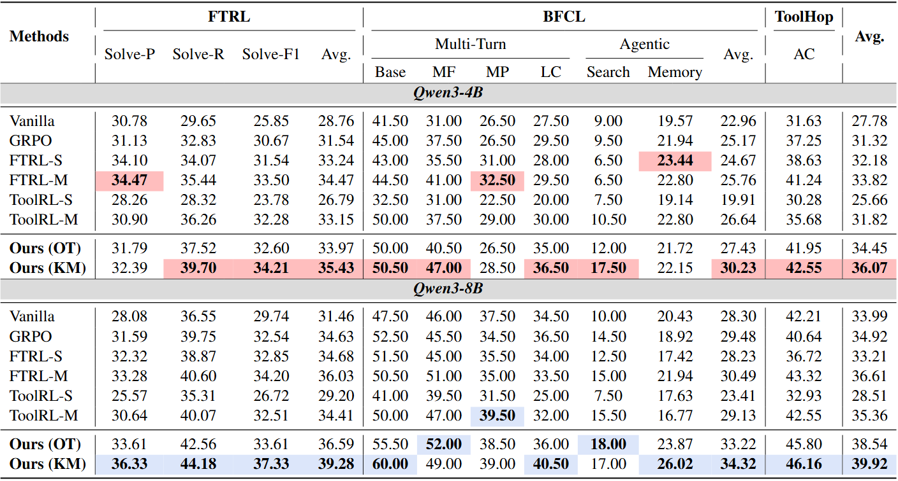

<h1 align="center">🛠️🤖 MatchTIR: Fine-Grained Supervision for
<br>
Tool-Integrated Reasoning via Bipartite Matching

</h1>

<div align="center"> 

[]()
[]()
[]()
[](https://www.python.org/downloads/release/python-390/) 
</div>

<h5 align="center"> If you like our project, please give us a star ⭐ on GitHub for the latest update.</h5>

## 📣 Latest News
- **[Jan 15, 2026]**: 📄 Our paper is now available on **[arXiv]()** and **[Hugging Face]()** daily paper.
- **[Jan 14, 2026]**: 🔥 We released all our **MatchTIR model checkpoints** and **datasets**. Checkout **[🤗 MatchTIR]()** here.
- **[Jan 14, 2026]**: 🚀 Full codebase of **MatchTIR** released.
  
## 📦 Dataset & Model Zoo

| **Dataset**         | **Download**                                                 |
| ----------------- | ------------------------------------------------------------ |
| FTRL Training Data | [🤗 HuggingFace]() |

| **Model**         | **Download**                                                 |
| ----------------- | ------------------------------------------------------------ |
| Qwen3-8B-MatchTIR-KM | [🤗 HuggingFace](https://huggingface.co/ChangleQu/Qwen3-8B-MatchTIR-KM) |
| Qwen3-4B-MatchTIR-KM | [🤗 HuggingFace](https://huggingface.co/ChangleQu/Qwen3-4B-MatchTIR-KM) |
| Qwen3-8B-MatchTIR-OT | [🤗 HuggingFace](https://huggingface.co/ChangleQu/Qwen3-8B-MatchTIR-OT) |
| Qwen3-4B-MatchTIR-OT | [🤗 HuggingFace](https://huggingface.co/ChangleQu/Qwen3-4B-MatchTIR-OT) |

## 💡 Overview
We propose **MatchTIR**, a framework that introduces fine-grained supervision via bipartite matching-based turn-level reward assignment and dual-level advantage estimation.

<p align="center">
    
</p>

### 📊 Overall Performance

<p align="center">
    
</p>

## 🛠️ Setup

<details open>
<summary><h3>🛠️Environment</h3></summary>
  
- Run the command to install the packages required.
  ```bash
  # Create conda environment
  conda create -n MatchTIR python=3.10
  conda activate MatchTIR
  
  # Install requirements
  cd MatchTIR-main
  pip install -r requirements.txt
  ```
</details>

<details open>
<summary><h3>🤖Model</h3></summary>
  
- Download LLMs from Huggingface. [Qwen3-4B](https://huggingface.co/Qwen/Qwen3-4B) and [Qwen3-8B](https://huggingface.co/Qwen/Qwen3-8B) .
</details>

<details open>
<summary><h3>📊 Benchmarks</h3></summary>

- Download Benchmarks.
  - [FTRL](https://arxiv.org/abs/2508.08791): Designed for evaluating tool-integrated reasoning under automatically constructed local execution environments.
  - [BFCL](https://www.google.com/search?q=bfcl&oq=bfcl&gs_lcrp=EgZjaHJvbWUqBggAEEUYOzIGCAAQRRg7MgYIARBFGD0yBggCEEUYPdIBBzg1MWowajeoAgCwAgA&sourceid=chrome&ie=UTF-8): A comprehensive and rigorous benchmark designed to evaluate the function-calling capabilities of LLMs across a wide range of scenarios.
  - [ToolHop](https://arxiv.org/abs/2501.02506): Designed to evaluate LLMs in multi-hop tool-use scenarios.

FTRL is used for training and in-domain evaluation, while BFCL and ToolHop are adopted for out-of-domain evaluation to assess generalization.
</details>

## ⚙️ Training Configuration
You can adjust the hyperparameters in `Scripts/run.sh`:
- `--custom_reward_function.name`: Choose between `compute_process_KM` (Hard) or `compute_process_ot` (Soft).
- `--actor_rollout_ref.model.path`: Path to your local LLM.
  
## 🚀 Quick Start

<summary><h3>🔥 Training</h3></summary>

- Run the shell script to perform policy optimization.
  ```bash
  Bash Scripts/run.sh
  ```
  
<summary><h3>🤖 Model Merge</h3></summary>

- Run the command to merge the trained model into SATETENSORS format.
  ```bash
  python3 Code/merge/merge_model.py merge --local_dir ${dir} --target_dir ${dir}
  ```

<summary><h3>🚀 Evaluation</h3></summary>

We evaluate **MatchTIR** on three benchmark datasets to assess its effectiveness and generalization ability across different tool-interaction scenarios.

### 📊 Benchmark 1: FTRL
  - Run evaluation on FTRL with:
  ```bash
  bash Scripts/eval_ftrl.sh
  ```

### 📊 Benchmark 2: BFCL
  - We use the official code provided by BFCL to perform evaluation. You can find the official code in the [BFCL](https://github.com/ShishirPatil/gorilla/blob/main/berkeley-function-call-leaderboard/README.md) repo. 

### 📊 Benchmark 3: ToolHop
 - Run evaluation on FTRL with:
  ```bash
  bash Scripts/eval_toolhop.sh
  ```

## 📄 Citation

If you find our code or work useful for your research, please cite our work.

```bibtex
@article{qu2026matchtir,
  title={MatchTIR: Fine-Grained Supervision for Tool-Integrated Reasoning via Bipartite Matching},
  author={Qu, Changle and Dai, Sunhao and Cai, Hengyi and Xu, Jun and Wang, Shuaiqiang and Yin, Dawei},
  year={2026}
}
```

## 📞 Contact

For any questions or feedback, please reach out to us at [changlequ@ruc.edu.cn](changlequ@ruc.edu.cn).

## ☕️ Acknowledgement
We employ the [VeRL 0.3.1.dev](https://arxiv.org/abs/2409.19256) framework for training.
